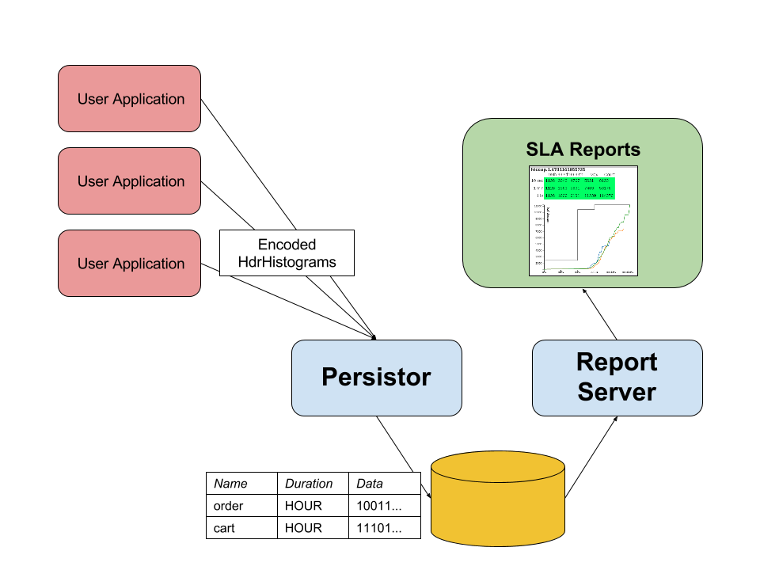

# Flute

## Measuring latency > sampling latency

### Overview

__Flute__ is a tool for measuring and recording application request latency
in order to provide accurate and detailed SLA reporting for 
internal or external consumption.  



At its core, __Flute__ provides three components:

* flute-client - your application's entry-point to __Flute__. Configure a `Stopwatch` for synchronous requests, 
or use a `ValueRecorder` if calculating request latency of an asynchronous request.
* flute-persistor - receives encoded `HdrHistgram` data from the client module, and persists it in the database.
* flute-server - serves historic data and manages SLA reports.


### Installation & configuration

Download the latest version here.

__Flute__ services can be run either in standalone mode, or embedded into your existing application infrastructure.
The steps below describe the fastest way to get up & running for an exploration of __Flute__.
Simple configuration is managed using Java properties files.


* Global configuration
   * Histogram configuration - this describes the constructor arguments used to create `Histograms` throughout the system
      * `flute.histogram.maxValue=100000`
      * `flute.histogram.significantDigits=3`

* Persistor configuration:  
   * listen address: 
      * e.g. `flute.server.tcp.listenAddress=0.0.0.0:51000`
   * database connection
      * `flute.db.metrics.username=SA`
      * `flute.db.metrics.password=password`
      * `flute.db.metrics.driver.className=org.h2.Driver`
      * `flute.db.metrics.url=jdbc:h2:tcp://localhost:9092/flute-metrics-db`
      
Ensure that the specified database exists, and that the user has `CREATE` privileges.
      
A persistor instance can then be started by running the following command:

```
java -cp ./flute-persistor-all-0.0.1 com.aitusoftware.flute.archive.FluteMetricsPersistorMain /path/to/config.properties
```

* Server configuration
   * listen address
      * `flute.server.httpPort=15002`
   * UI resources
      * `flute.resource.base=server/src/main/resources/ui`
   * database connection
      * `flute.db.metrics.username=SA`
      * `flute.db.metrics.password=password`
      * `flute.db.metrics.driver.className=org.h2.Driver`
      * `flute.db.metrics.url=jdbc:h2:tcp://localhost:9092/flute-metrics-db`
      * `flute.db.reports.username=SA`
      * `flute.db.reports.password=password`
      * `flute.db.reports.driver.className=org.h2.Driver`
      * `flute.db.reports.url=jdbc:h2:tcp://localhost:9092/flute-reports-db`

* Client configuration
   * code configuration:
```
return new RecordingTimeTrackerFactory().
    publishingTo(new InetSocketAddress("127.0.0.1", 51000)).
    withSenderEvents(new ExceptionTrackingAggregatorEvents(sendExceptions)).
    withIdentifer("businessMethodId").
    publishingEvery(1L, TimeUnit.MINUTES).
    withHistogramConfig(new HistogramConfig(100000, 3)).
    create();
```